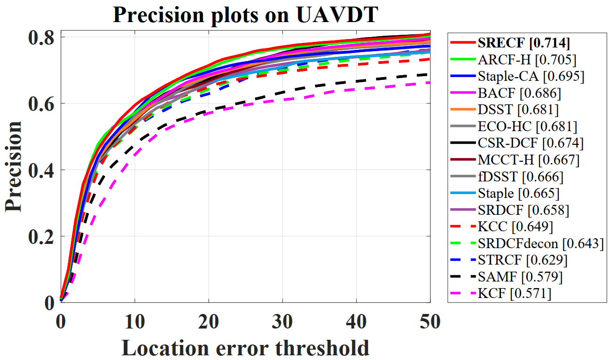
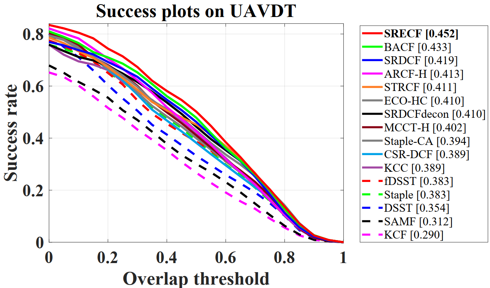
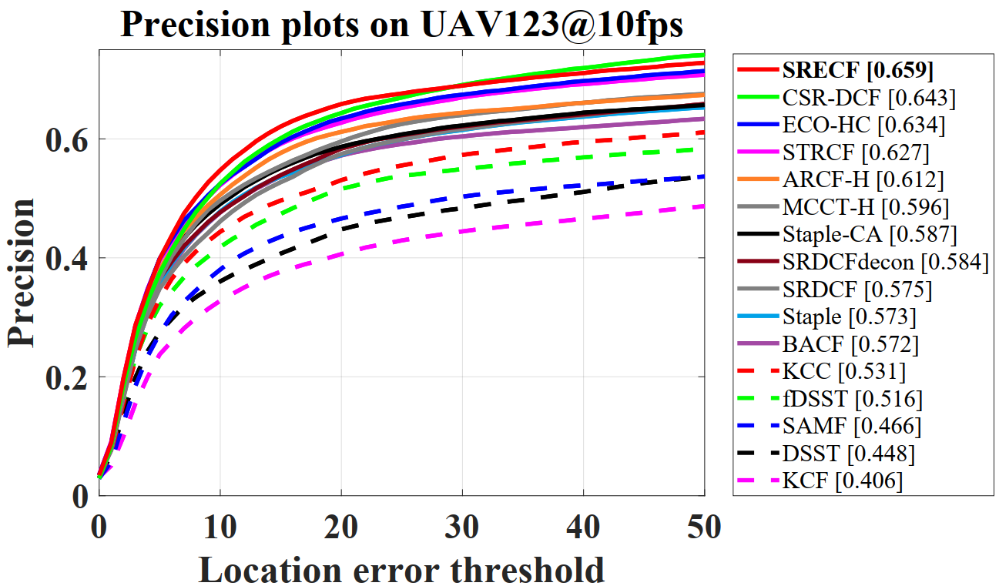
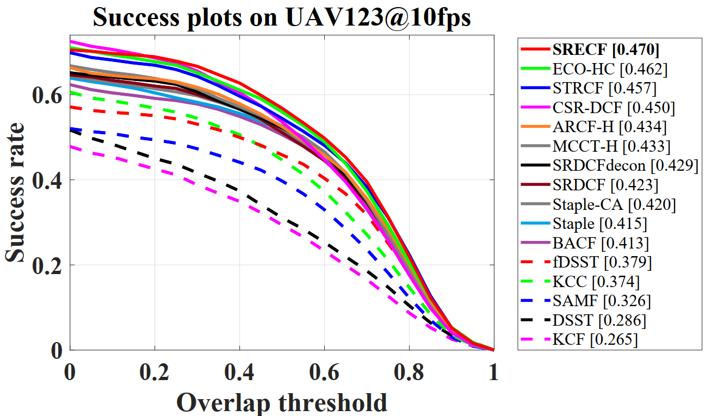
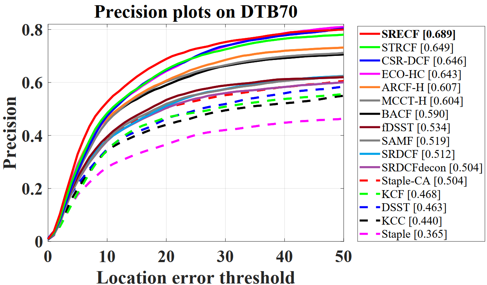
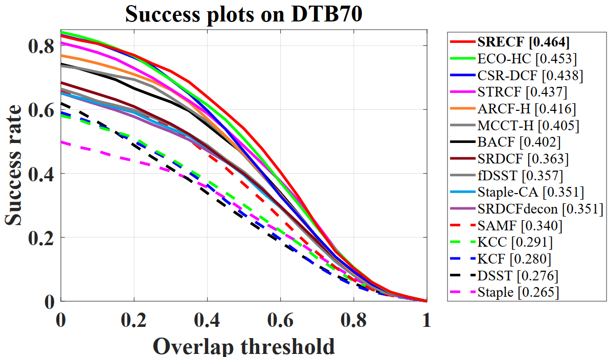

# Learning Spatial Reliability Enhanced Correlation Filters for Fast UAV Tracking  
Matlab implementation of our spatial reliability enhanced correlation filters (SRECF) tracker.

# Abstract

Recently, by virtue of its impressive efficiency, discriminative correlation filter (DCF) type tracker has achieved promising applications in unmanned aerial vehicle (UAV) tracking tasks. However, the performance of such trackers remains unsatisfactory because of several challenging factors in the aerial environment. Most research attempts to improve the discrimination capability of the entire filter but ignore the distinctiveness of different spatial locations. In this work, appearance variation information is fully exploited to generate a dynamic spatial reliability map which indicates pixel-level reliability. By supervising and adaptively penalizing the locations with low reliability, the filter is equipped with better discrimination capability, thereby forcing the filter to pay more attention to the target. Meanwhile, a novel adaptively updated response pool is proposed to provide a reliable reference to calculate the reliability map. Substantial experiments on three challenging UAV benchmarks validate the superiority of the proposed scheme against other state-of-the-art works. Moreover, our proposed tracker's real-time tracking speed meets the requirement of real-world UAV tracking tasks.

# Publication

SRECF is proposed in our paper for ICRA 2021. Detailed explanation of our method can be found in the paper:

Changhong Fu, Jin Jin, Fangqiang Ding, Yiming Li, and Geng Lu.

Learning Spatial Reliability Enhanced Correlation Filters for Fast UAV Tracking  

# Contact

Changhong Fu

Email: [changhong.fu@tongji.edu.cn](mailto:changhong.fu@tongji.edu.cn)

# Demonstration running instructions

This code is compatible with UAVDT, UAV123@10fps and DTB70 benchmark. Therefore, if you want to run it in benchmark, just put SRECF folder in trackers, and config sequences and trackers according to instructions from aforementioned benchmarks. 

# Results on UAV datasets

### UAVDT

### UAV123@10fps

### DTB70

### 

# Acknowledgements

We thank the contribution of Hamed Kiani Galoogahi, Ning Wang and Martin Danelljan for their previous work BACF,  MCCT-H and DSST.  The feature extraction modules and some of the parameter are borrowed from the MCCT tracker (https://github.com/594422814/MCCT). The scale estimation method is borrowed from the DSST tracker (http://www.cvl.isy.liu.se/en/research/objrec/visualtracking/scalvistrack/index.html).

