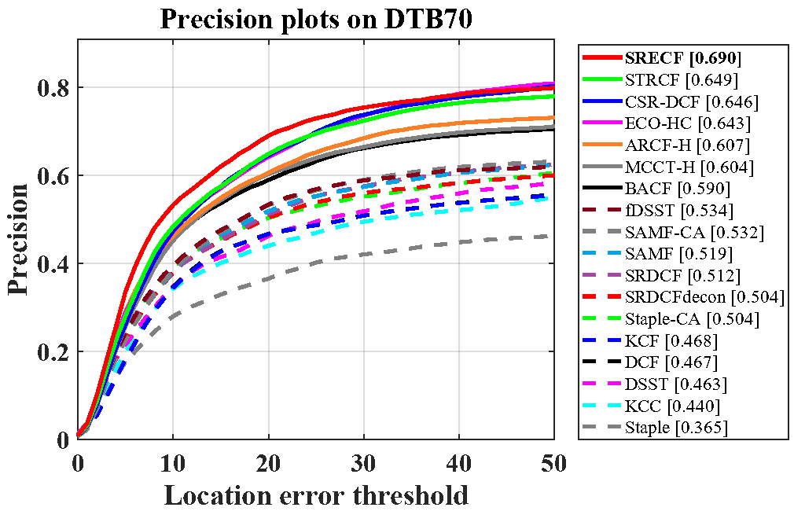
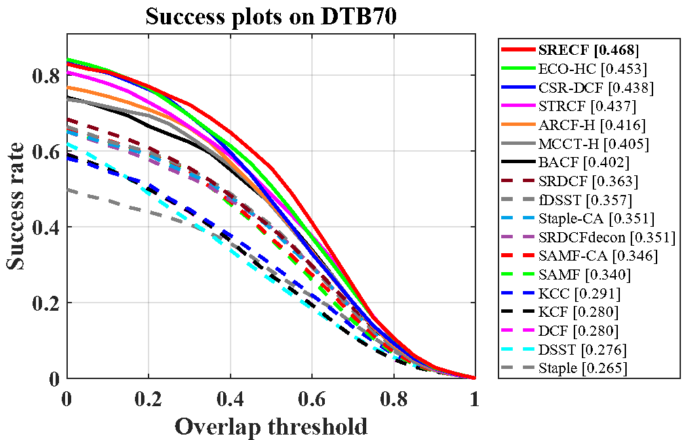

# Spatial Reliability Enhanced Correlation Filter: An Efficient Approach for Real-Time UAV Tracking  
Matlab implementation of our spatial reliability enhanced correlation filters (SRECF) tracker.

# Abstract

Traditional discriminative correlation filter (DCF) has received great popularity due to its high computational efficiency. However, the lightweight framework of DCF cannot promise robust performance when the tracker faces appearance variations within the background area of the image patch. That is, these unpredictable appearance variations always distract and then corrupt the filter. Most existing DCF-based trackers either utilize deep convolutional features or incorporate additional constraints to elevate tracking robustness. Despite some improvements, both of them hamper the tracking speed and can only roughly alleviate the distractions of appearance variations in a global perspective. In this paper, a novel spatial reliability enhanced learning strategy equipped with selectively updated response pool and adaptive label adjustment is proposed to handle the problems aforementioned. By monitoring the variation of response produced in detection phase, a dynamic reliability map is generated to indicate the reliability of each background subregions. Then, label adjustment is conducted to repress the distraction of these unreliable areas. Compared with the conventional way of constraint where a new term is always added to realize the desired goal, label adjustment is simultaneously more efficient and effective. Moreover, to promise the accuracy and dependability of the proposed reliability map, a selectively updated response pool recording reliable historical response values is proposed complementally. Extensive and exhaustive experiments on three challenging unmanned aerial vehicle (UAV) benchmarks, i.e., UAV123@10fps, DTB70 and UAVDT, which totally include 243 video sequences validate the superiority of the proposed method against other state-of-the-art trackers and exhibit a remarkable generality in a variety of scenarios. Meanwhile, the tracking speed of 65.2FPS on a cheap CPU makes it suitable for real-time UAV applications.

# Publication

SRECF is proposed in our paper for TMM. Detailed explanation of our method can be found in the paper:

Changhong Fu, Jin Jin, Fangqiang Ding, Yiming Li, and Geng Lu.

Learning Spatial Reliability Enhanced Correlation Filters for Fast UAV Tracking  

# Contact

Changhong Fu

Email: [changhong.fu@tongji.edu.cn](mailto:changhong.fu@tongji.edu.cn)

Jin Jin

Email: jinjin.gentle@gmail.com

# Demonstration running instructions

This code is compatible with UAVDT, UAV123@10fps and DTB70 benchmark. Therefore, if you want to run it in benchmark, just put SRECF folder in trackers, and config sequences and trackers according to instructions from aforementioned benchmarks. 

# Results on UAV datasets

### UAVDT

### UAV123@10fps

### DTB70

### 

# Acknowledgements

We thank the contribution of Hamed Kiani Galoogahi, Ning Wang and Martin Danelljan for their previous work BACF,  MCCT-H and DSST.  The feature extraction modules and some of the parameter are borrowed from the MCCT tracker (https://github.com/594422814/MCCT). The scale estimation method is borrowed from the DSST tracker (http://www.cvl.isy.liu.se/en/research/objrec/visualtracking/scalvistrack/index.html).

